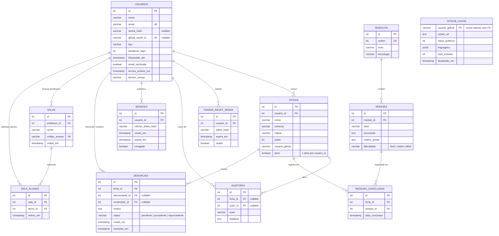

# CodeQuest

> Spec revisada para seguir exatamente as **8 seções** do template do Anexo A da apostila, na ordem exigida pelo enunciado da atividade avaliativa (Objetivo → Usuários → Casos de uso → Requisitos funcionais → Requisitos não funcionais → Modelo de dados com DER visual → Critérios de aceite → Decisão de stack e deploy). Nesta revisão: (1) adicionada a Seção 8, que estava ausente; (2) adicionado o diagrama DER em Mermaid na Seção 6; (3) adicionados critérios de aceite para RFs do MVP que ainda não tinham um; (4) a Seção 5 foi separada em RN/RNF/RI numerados; (5) **expansão de profundidade**: os requisitos funcionais foram reorganizados em 10 módulos e cresceram de 21 para 30 itens (verificação de e-mail, edição de conta, logout/encerramento de sessões, termos de uso, exclusão de conta, ordenação alternativa, atualização manual de cache, progresso salvo na trilha, filtro de missões por dificuldade, histórico de missões, validação HMAC de webhook, badges, log de auditoria consultável, denúncia/moderação detalhadas, convite/remoção em sala, exportação de relatório e de dados pessoais, painel de métricas, suspensão de conta); as Regras de Negócio cresceram de 6 para 13 e os Requisitos Não Funcionais de 12 para 19; a categoria de Interface ganhou 5 itens novos; e o modelo de dados (Seção 6) recebeu as tabelas `sessoes`, `denuncias`, `salas` e `sala_alunos`, além de colunas novas em `usuarios` e `missoes`, para sustentar tecnicamente todos esses requisitos novos — nenhum deles ficou "no ar" sem representação no schema.

## 1. Objetivo

O CodeQuest é uma plataforma web gamificada que transforma a prática de programação em uma progressão de RPG, para desenvolvedores júniores e estudantes de TI que perdem a motivação em ferramentas de portfólio passivas (perfil estático do GitHub, README). Cada usuário mantém uma "ficha de personagem" cujo atributo de poder evolui com a conclusão de missões pedagógicas e com a atividade real verificada na sua conta do GitHub, tornando o progresso visível, contínuo e verificável.

## 2. Usuários

* **Visitante (não autenticado)**: navega pela listagem pública de personagens ativos, usa busca e filtros por universo, e visualiza o ranking público (quando disponível).
* **Estudante / Desenvolvedor Júnior**: cria conta, cadastra e edita a própria ficha de personagem, vincula sua conta do GitHub, arquiva/restaura sua ficha, percorre a trilha de aprendizagem e submete missões.
* **Professor / Educador**: tudo que o Estudante faz, mais criar salas de aula virtuais, matricular turmas, atribuir missões e acompanhar o progresso de cada aluno.
* **Moderador de Conteúdo**: analisa denúncias de fichas (nomes/conteúdos impróprios) e confirma ou rejeita arquivamentos.
* **Administrador / Curador Oficial**: acesso total — cadastra e mantém as missões e módulos oficiais, gerencia permissões de moderadores, acessa o painel administrativo e executa a exclusão definitiva de dados por solicitação LGPD.

## 3. Casos de uso principais

* Visitante busca e filtra a listagem pública de personagens ativos.
* Estudante cria uma conta (e-mail/senha) ou entra com login social do GitHub.
* Estudante confirma o e-mail da conta via link de verificação.
* Estudante aceita os Termos de Uso e a Política de Privacidade no cadastro.
* Estudante recupera a senha esquecida via link enviado por e-mail.
* Estudante edita os dados da própria conta (nome, e-mail, senha).
* Estudante encerra a sessão atual ou todas as sessões ativas de uma vez.
* Estudante exclui a própria conta, disparando a rotina de anonimização/exclusão LGPD.
* Estudante cadastra sua ficha de personagem (nome, universo, classe, poder inicial).
* Estudante vincula o username do GitHub à sua ficha e visualiza as métricas públicas (repositórios, estrelas).
* Estudante força a atualização manual do cache de métricas do GitHub da própria ficha.
* Estudante arquiva a própria ficha (exclusão lógica) e, se quiser, restaura uma ficha arquivada anteriormente.
* Estudante percorre a trilha de aprendizagem (Blocos → Python → HTML/CSS → JavaScript), retomando de onde parou.
* Estudante filtra o catálogo de missões por módulo e por dificuldade, e consulta seu próprio histórico de missões concluídas.
* Estudante exporta os próprios dados em formato legível (portabilidade LGPD).
* Professor cria uma sala de aula virtual, convida alunos por e-mail ou código de acesso, e remove um aluno da turma.
* Professor exporta um relatório de progresso da turma.
* Administrador cadastra uma missão oficial vinculada a um módulo da trilha.
* Administrador consulta e filtra o log de auditoria por ficha, autor, ação e período.
* Administrador acompanha métricas agregadas do sistema em um painel (usuários, fichas ativas, missões concluídas).
* Administrador suspende ou reativa a conta de um usuário.
* Estudante denuncia uma ficha com conteúdo impróprio e acompanha o status da própria denúncia.
* Moderador analisa uma denúncia recebida sobre uma ficha e decide arquivá-la ou rejeitar a denúncia.
* Administrador executa a exclusão definitiva dos dados pessoais de um usuário mediante solicitação LGPD.

## 4. Requisitos funcionais

### Módulo A — Conta e Autenticação

* **RF01a** — Cadastro e login por e-mail/senha, com sessão em cookie `HttpOnly`/`Secure`/`SameSite=Strict`, bloqueio após 5 tentativas falhas seguidas e fluxo de "esqueci minha senha" com token de uso único (expira em 1h) limitado a 1 solicitação por e-mail e por IP a cada 2 minutos. *(MVP)*
* **RF01b** — Login social via OAuth do GitHub, vinculando à ficha já existente quando houver `usuario_github` correspondente. *(V2)*
* **RF01c** — Verificação de e-mail obrigatória: ao cadastrar, um token de confirmação é enviado por e-mail; a conta fica em estado "pendente" e funcionalidades de escrita (criar/editar ficha) ficam bloqueadas até a confirmação (ver RN12). *(MVP)*
* **RF01d** — Edição dos dados da própria conta (nome, e-mail, senha) pelo usuário autenticado; alterar o e-mail exige nova verificação (RF01c) antes de valer para login. *(MVP)*
* **RF01e** — Logout da sessão atual, e opção separada "Encerrar todas as sessões", que revoga todos os *refresh tokens* ativos do usuário na tabela `sessoes` (ver Seção 6). *(MVP)*
* **RF01f** — Aceite obrigatório dos Termos de Uso e da Política de Privacidade no cadastro (checkbox não pré-marcado), registrado com `timestamp` e a versão do termo aceito. *(MVP)*
* **RF01g** — Exclusão da própria conta pelo usuário, mediante confirmação explícita (reautenticação de senha), disparando a mesma rotina de anonimização/exclusão definitiva da RNF06. *(V2)*

### Módulo B — Ficha de Personagem

* **RF02** — Cadastro da ficha de personagem: `nome`, `universo` (ENUM), `classe`, `poder` (0–100), `data_nascimento` (opcional), `email` de exibição (opcional), `usuario_github` (opcional). Bloqueado se o usuário já tiver uma ficha ativa (ver Seção 6). *(MVP)*
* **RF03** — Lista fechada de universos permitidos: Marvel, DC, Star Wars, Tolkien, D&D, Anime, Games. *(MVP)*
* **RF04** — Validação dupla (cliente e servidor) com retenção de estado do formulário em caso de erro. *(MVP)*
* **RF05** — Exclusão lógica (arquivamento) da ficha, com confirmação explícita; ficha some da listagem pública. *(MVP)*
* **RF06** — Restauração de ficha arquivada; se já existir outra ficha ativa, a atual é arquivada na mesma operação (ver Seção 6). *(MVP)*

### Módulo C — Navegação, Listagem e Busca

* **RF07** — Listagem paginada (10/página) de personagens ativos, ordenada por nome por padrão. *(MVP)*
* **RF07a** — Ordenação alternativa da listagem, selecionável pelo usuário: por nome (padrão), por poder (decrescente) ou por data de criação (mais recentes primeiro). *(V2)*
* **RF08** — Busca textual por nome/classe combinável com filtro de universo. *(MVP)*
* **RF09** — Área separada para visualizar e restaurar fichas arquivadas. *(MVP)*

### Módulo D — Integração com o GitHub

* **RF10** — Validação do formato do username do GitHub (até 39 caracteres, alfanumérico/hífen). *(MVP)*
* **RF11** — Exibição de métricas públicas do GitHub (avatar, repositórios, linguagens, estrelas) com link para o perfil. *(MVP)*
* **RF12** — Timeout de 3s na chamada à API do GitHub e cache persistido em tabela relacional (`github_cache`, expiração de 1h) para contornar o limite de 60 req/h sem autenticação (5.000 req/h com `GITHUB_API_TOKEN`); falha exibe aviso sem quebrar a ficha. *(MVP)*
* **RF12a** — Revalidação do cache expirado é assíncrona e não bloqueia a renderização da ficha: a UI exibe os últimos dados em cache com um indicador "atualizando" enquanto a nova consulta acontece em segundo plano. *(V2)*
* **RF12b** — Botão manual "Atualizar agora" para forçar a revalidação do cache antes da expiração natural, limitado a 1 uso por usuário a cada 5 minutos (evita contornar o cache e estourar o rate limit da API do GitHub). *(V2)*

### Módulo E — Trilha de Aprendizagem e Missões

* **RF13** — Trilha de aprendizagem em 4 módulos encadeados: Blocos → Python → HTML/CSS → JavaScript, como conteúdo estático navegável. *(MVP)*
* **RF13a** — O progresso do estudante na trilha (módulos/missões já concluídos) é salvo e exibido visualmente ao retomar a navegação. *(V2)*
* **RF14** — Cadastro e curadoria de missões por módulo (título, enunciado, código inicial, critério de aceite, dificuldade). *(V2)*
* **RF14a** — Listagem de missões filtrável por módulo e por dificuldade (fácil, médio, difícil). *(V2)*
* **RF15** — Registro de conclusão de missão (única por ficha), validada automaticamente ou por aprovação manual do professor. *(V2)*
* **RF15a** — Quando a validação for automática via Webhook do GitHub, o servidor deve verificar a assinatura HMAC do payload recebido antes de processar, rejeitando requisições não assinadas ou com assinatura inválida. *(V2)*
* **RF15b** — O estudante consulta o próprio histórico de missões concluídas, com título da missão e data de conclusão. *(V2)*

### Módulo F — Gamificação, Poder e Ranking

* **RF16** — Cálculo automático e neutro de poder combinando missões concluídas e atividade real do GitHub, sem penalizar perfis privados ou iniciantes. *(Futuro)*
* **RF17** — Ranking público paginado dos personagens mais poderosos, com filtros por universo/período. *(Futuro)*
* **RF17a** — Sistema de conquistas (badges) por marcos de progresso (ex.: primeira missão concluída, 7 dias seguidos de atividade), exibidas na ficha do personagem. *(Futuro)*

### Módulo G — Auditoria e Moderação

* **RF18** — Auditoria inviolável de toda criação, alteração, arquivamento e restauração de ficha. *(MVP)*
* **RF18a** — Administrador consulta e filtra o log de auditoria por ficha, autor, tipo de ação e período de data. *(V2)*
* **RF19** — Denúncia de fichas com conteúdo impróprio (nome ou dados ofensivos/spam), registrada com motivo, denunciante e status (pendente/procedente/improcedente). *(V2)*
* **RF19a** — Moderação da denúncia: o moderador confirma (arquiva a ficha) ou rejeita, com justificativa registrada em auditoria; um moderador não pode analisar denúncia relacionada à própria ficha. *(V2)*
* **RF19b** — O denunciante acompanha o status da própria denúncia (pendente, procedente ou improcedente). *(V2)*

### Módulo H — Salas de Aula para Professores

* **RF20** — Espaço do educador: professor cria salas virtuais, gera código de acesso para alunos, acompanha a matriz de progresso da turma e atribui missões personalizadas. *(V2)*
* **RF20a** — Convite de alunos para a sala por e-mail, além do código de acesso reutilizável. *(V2)*
* **RF20b** — Remoção de um aluno de uma sala pelo professor responsável. *(V2)*
* **RF20c** — Exportação (CSV) do relatório de progresso da turma pelo professor. *(V2)*

### Módulo I — Privacidade e Dados Pessoais

* **RF21** — Configurações de privacidade: opções no painel do usuário para ocultar e-mail pessoal e/ou optar por não aparecer no ranking público. *(V2)*
* **RF21a** — Exportação dos próprios dados pessoais em formato legível (JSON), atendendo ao direito de portabilidade previsto na LGPD. *(V2)*

### Módulo J — Administração do Sistema

* **RF22** — Painel administrativo com métricas agregadas: total de usuários cadastrados, total de fichas ativas e total de missões concluídas no período selecionado. *(V2)*
* **RF23** — Suspensão e reativação de contas de usuário pelo Administrador (bloqueia login sem excluir os dados), distinta da exclusão definitiva por LGPD (RF01g). *(V2)*

## 5. Requisitos não funcionais

### Regras de Negócio (RN)

* **RN01** — O atributo `poder` deve se manter estritamente no intervalo entre 0 e 100.
* **RN02** — O campo `universo` aceita estritamente os 7 valores da lista fechada: Marvel, DC, Star Wars, Tolkien, D&D, Anime, Games.
* **RN03** — A remoção de fichas é obrigatoriamente uma exclusão lógica (`ativo = 0`); toda instrução de alteração ou exclusão no banco exige a cláusula `WHERE id = :id`.
* **RN04** — Os registros da tabela `auditoria` são de leitura exclusiva — não podem sofrer `UPDATE` nem `DELETE` por nenhum usuário do sistema.
* **RN05** — Apenas usuários com perfil Administrador podem criar ou alterar as missões e os módulos oficiais da plataforma.
* **RN06** — Cada usuário pode ter no máximo **1 (uma) ficha ativa** por vez; para criar ou restaurar uma nova ficha enquanto já existe uma ativa, a ficha ativa anterior deve ser arquivada na mesma transação.
* **RN07** — Um mesmo e-mail não pode estar associado a mais de uma conta (unicidade reforçada tanto pela validação do servidor quanto pela constraint `UNIQUE` em `usuarios.email`).
* **RN08** — O `nome` da ficha deve ter entre 2 e 100 caracteres e não pode ser composto só de espaços ou caracteres especiais.
* **RN09** — Um mesmo `usuario_github` não pode estar vinculado simultaneamente a fichas ativas de contas diferentes — evita que duas pessoas reivindiquem o mesmo perfil do GitHub ao mesmo tempo.
* **RN10** — Quando uma denúncia é confirmada como procedente por um moderador, a ficha é arquivada automaticamente; reverter esse arquivamento exige aprovação de um Administrador, nunca do moderador que analisou a denúncia sozinho.
* **RN11** — Sessões expiram automaticamente após 30 minutos de inatividade, independentemente do prazo de validade do cookie (até 7 dias) definido em RF01a.
* **RN12** — Contas com e-mail não verificado (RF01c) em até 7 dias após o cadastro têm bloqueado o acesso a funcionalidades de escrita (criar, editar, arquivar ou restaurar ficha) até a confirmação.
* **RN13** — Uma missão só pode ser removida fisicamente do catálogo se nenhuma ficha a tiver concluído (`missoes_concluidas` sem registros para ela); caso já tenha sido concluída por alguém, é apenas desativada para novos registros, preservando o histórico de quem já a completou.

### Requisitos Não Funcionais (RNF)

* **RNF01** — Senhas nunca em texto puro — hash com `bcrypt` (custo ≥ 10) ou `Argon2id`; contas OAuth-only podem não ter senha, mas precisam de pelo menos um método de login válido.
* **RNF02** — Todo formulário validado no servidor, nunca só no cliente.
* **RNF03** — Toda consulta ao banco via *prepared statements* (nunca concatenação de string).
* **RNF04** — Escape de saída (HTML/JSX) contra XSS; proteção CSRF nas rotas que alteram estado.
* **RNF05** — Nenhuma credencial no código-fonte — tudo em variável de ambiente (`DATABASE_URL`, `SESSION_SECRET`/`JWT_SECRET`, `GITHUB_OAUTH_CLIENT_ID/SECRET`, `GITHUB_API_TOKEN`, `SMTP_*`).
* **RNF06** — A exclusão definitiva por solicitação LGPD deve, na mesma rotina: anonimizar os dados pessoais, encerrar todas as sessões ativas, revogar *refresh tokens* (tabela `sessoes`, ver Seção 6) e apagar tokens pendentes de reset de senha.
* **RNF07** — Apenas o dono da ficha ou administradores podem editar/arquivar/restaurar — checagem sempre no servidor.
* **RNF08** — Timeout de 3s nas chamadas à API do GitHub; cache relacional de 1h (não em memória de processo, por ser arquitetura Serverless).
* **RNF09** — Deploy contínuo via GitHub → Vercel; banco relacional em nuvem (ex.: Neon Postgres).
* **RNF10** — Backups automáticos diários, retenção mínima de 7 dias (RPO ≤ 24h).
* **RNF11** — Erros 5xx logados no servidor (timestamp, rota, stack trace) sem expor detalhes ao usuário.
* **RNF12** — Coleta de dados restrita ao necessário, com mecanismos de correção e exclusão pelo titular (LGPD).
* **RNF13** — Rate limiting geral nas rotas públicas (listagem, busca, ranking): no máximo 100 requisições por minuto por IP, retornando HTTP 429 acima do limite.
* **RNF14** — HTTPS obrigatório em todas as rotas, com cabeçalho `Strict-Transport-Security` habilitado (redirecionamento automático de HTTP para HTTPS é garantido pela Vercel).
* **RNF15** — Cabeçalhos de segurança HTTP obrigatórios em toda resposta: `Content-Security-Policy`, `X-Content-Type-Options: nosniff` e `X-Frame-Options: DENY`.
* **RNF16** — Tempo de resposta: páginas de listagem e busca devem responder em até 1s no percentil 95, desconsiderando a latência de chamadas à API externa do GitHub.
* **RNF17** — Logs estruturados em JSON, com um identificador de requisição (`request_id`) que correlaciona todas as entradas geradas por uma mesma chamada, para facilitar a depuração de incidentes.
* **RNF18** — Compatibilidade garantida com as versões atuais dos navegadores Chrome, Firefox e Edge.
* **RNF19** — Idioma padrão da interface: Português do Brasil (pt-BR), incluindo mensagens de erro e e-mails transacionais.

### Requisitos de Interface (RI)

* **RI01** — Formulários devem reter os dados já digitados e sinalizar visualmente os campos com erro após uma falha de validação (ver RF04).
* **RI02** — Toda ação destrutiva (ex.: arquivar ficha, excluir conta) exige confirmação explícita via modal antes de ser executada (ver RF05, RF01g).
* **RI03** — Buscas sem resultado exibem uma mensagem de estado vazio amigável (ex.: "Nenhum personagem encontrado"), nunca uma tela em branco (ver RF08).
* **RI04** — A interface deve ser responsiva, plenamente utilizável tanto em dispositivos móveis quanto em desktop.
* **RI05** — A interface deve atender a critérios mínimos de acessibilidade: alto contraste e navegação completa por teclado.
* **RI06** — Indicadores de carregamento (spinner ou skeleton) durante chamadas assíncronas (ex.: consulta à API do GitHub, RF12a), nunca uma tela travada sem feedback visual.
* **RI07** — Mensagens de erro específicas por campo do formulário, e não uma única mensagem genérica cobrindo o formulário inteiro.
* **RI08** — Campos obrigatórios são sinalizados visualmente (ex.: asterisco) antes mesmo da tentativa de envio do formulário.
* **RI09** — Confirmação visual (toast/snackbar) após ações bem-sucedidas: ficha salva, missão concluída, e-mail de verificação/reset enviado.
* **RI10** — Componentes de paginação (listagem, ranking) sempre exibem a página atual e o total de páginas, e mantêm os filtros ativos ao navegar entre páginas.

## 6. Modelo de dados (DER simples)

**Tabelas principais e relacionamentos:**
* `usuarios` (1) — (N) `fichas`: cada ficha pertence a exatamente um usuário; um usuário pode ter várias fichas ao longo do tempo, mas **no máximo uma ativa por vez**.
* `usuarios` (1) — (N) `tokens_reset_senha`: tokens de recuperação de senha, um usuário pode ter vários (histórico), mas só o mais recente e não usado é válido.
* `usuarios` (1) — (N) `auditoria`: cada ação registrada tem um autor.
* `fichas` (1) — (N) `auditoria`: cada ficha acumula um histórico de ações.
* `fichas` (1) — (1) `github_cache`: relacionamento indireto via `usuario_github` (chave natural), não FK — o cache é compartilhado entre fichas que apontem para o mesmo username.
* `modulos` (1) — (N) `missoes`: cada missão pertence a um módulo da trilha.
* `fichas` (N) — (N) `missoes`, via `missoes_concluidas`: registra qual ficha concluiu qual missão, uma única vez cada (`UNIQUE(ficha_id, missao_id)`).
* `usuarios` (1) — (N) `sessoes`: cada sessão/refresh token ativo pertence a um usuário (suporta RF01e — logout de todas as sessões — e RNF06).
* `fichas` (1) — (N) `denuncias`: uma ficha pode acumular várias denúncias; cada denúncia tem um denunciante (`usuario_id`, nullable se a conta for excluída depois) e, quando analisada, um moderador responsável (RF19/RF19a/RF19b).
* `usuarios` (1) — (N) `salas` (como professor): um professor pode criar várias salas; `usuarios` (N) — (N) `salas` (como aluno), via `sala_alunos`, suportando RF20/RF20a/RF20b.

**Diagrama entidade-relacionamento:**



*Nota: `github_cache` está desenhada solta no diagrama porque se liga a `fichas` por chave natural (`usuario_github`), não por chave estrangeira — de propósito, para o cache ser compartilhado entre fichas diferentes que apontem para o mesmo usuário do GitHub, em vez de duplicado por ficha.*

```sql
-- Tabela de Usuários / Autenticação
CREATE TABLE usuarios (
    id SERIAL PRIMARY KEY,
    nome VARCHAR(100) NOT NULL,
    email VARCHAR(150) UNIQUE NOT NULL,
    senha_hash VARCHAR(255),              -- NULL permitido: conta pode ser só OAuth (RF01b)
    github_oauth_id VARCHAR(50) UNIQUE,   -- preenchido no login OAuth (RF01b)
    tipo VARCHAR(20) DEFAULT 'estudante' CHECK (tipo IN ('estudante', 'professor', 'moderador', 'admin')),
    tentativas_login INT DEFAULT 0,
    bloqueado_ate TIMESTAMP,              -- suporta o RF01a (bloqueio após 5 falhas)
    email_verificado BOOLEAN DEFAULT FALSE,  -- suporta RF01c / RN12
    termos_aceitos_em TIMESTAMP,             -- suporta RF01f
    termos_versao VARCHAR(20),               -- suporta RF01f
    criado_em TIMESTAMP DEFAULT CURRENT_TIMESTAMP,
    CONSTRAINT chk_metodo_login CHECK (senha_hash IS NOT NULL OR github_oauth_id IS NOT NULL)
);

-- Tokens de recuperação de senha (RF01a)
CREATE TABLE tokens_reset_senha (
    id SERIAL PRIMARY KEY,
    usuario_id INT REFERENCES usuarios(id) ON DELETE CASCADE,
    token_hash VARCHAR(255) NOT NULL,
    expira_em TIMESTAMP NOT NULL,
    usado BOOLEAN DEFAULT FALSE,
    criado_em TIMESTAMP DEFAULT CURRENT_TIMESTAMP
);

-- Sessões / refresh tokens ativos (RF01e — logout de todas as sessões; RNF06)
CREATE TABLE sessoes (
    id SERIAL PRIMARY KEY,
    usuario_id INT REFERENCES usuarios(id) ON DELETE CASCADE,
    refresh_token_hash VARCHAR(255) NOT NULL,
    criado_em TIMESTAMP DEFAULT CURRENT_TIMESTAMP,
    expira_em TIMESTAMP NOT NULL,
    revogado BOOLEAN DEFAULT FALSE
);

-- Cache persistido das métricas públicas do GitHub (RF12) — relacional por design,
-- para sobreviver a instâncias efêmeras da arquitetura Serverless/Vercel.
CREATE TABLE github_cache (
    usuario_github VARCHAR(39) PRIMARY KEY,
    avatar_url TEXT,
    repos_publicos INT DEFAULT 0,
    linguagens JSONB,
    total_estrelas INT DEFAULT 0,
    atualizado_em TIMESTAMP DEFAULT CURRENT_TIMESTAMP
    -- Expiração de 1h aplicada na leitura: se (NOW() - atualizado_em) > 1h, a aplicação
    -- revalida contra a API do GitHub e faz UPSERT nesta linha.
);

-- Tabela de Fichas de Personagem
CREATE TABLE fichas (
    id SERIAL PRIMARY KEY,
    usuario_id INT REFERENCES usuarios(id) ON DELETE CASCADE,
    nome VARCHAR(100) NOT NULL,
    universo VARCHAR(30) NOT NULL CHECK (universo IN ('Marvel', 'DC', 'Star Wars', 'Tolkien', 'D&D', 'Anime', 'Games')),
    classe VARCHAR(50) NOT NULL,
    poder INT NOT NULL CHECK (poder BETWEEN 0 AND 100),
    data_nascimento DATE,
    email VARCHAR(150),
    usuario_github VARCHAR(39),
    ativo BOOLEAN DEFAULT TRUE,
    criado_em TIMESTAMP DEFAULT CURRENT_TIMESTAMP,
    atualizado_em TIMESTAMP DEFAULT CURRENT_TIMESTAMP
);

-- Impõe "1 ficha ativa por usuário" no nível do banco, mesmo que a aplicação
-- falhe em checar isso antes de gravar (proteção contra race conditions).
CREATE UNIQUE INDEX idx_ficha_ativa_unica_por_usuario
ON fichas (usuario_id)
WHERE ativo = TRUE;

-- Impõe a RN09: um usuario_github não pode estar vinculado a mais de uma ficha ativa ao mesmo tempo.
CREATE UNIQUE INDEX idx_github_unico_em_ficha_ativa
ON fichas (usuario_github)
WHERE ativo = TRUE AND usuario_github IS NOT NULL;

-- Índices de performance para busca/filtro (RF08) e listagem (RF07)
CREATE INDEX idx_fichas_busca_ativa ON fichas (ativo, universo, nome);
-- Índice de performance para o ranking público (RF17)
CREATE INDEX idx_fichas_ranking ON fichas (ativo, poder DESC);

-- Tabela de Módulos da Trilha Pedagógica
CREATE TABLE modulos (
    id SERIAL PRIMARY KEY,
    ordem INT UNIQUE NOT NULL,
    titulo VARCHAR(100) NOT NULL,
    tecnologia VARCHAR(50) NOT NULL,
    descricao TEXT NOT NULL
);

-- Tabela de Missões / Exercícios
CREATE TABLE missoes (
    id SERIAL PRIMARY KEY,
    modulo_id INT REFERENCES modulos(id) ON DELETE CASCADE,
    titulo VARCHAR(150) NOT NULL,
    enunciado TEXT NOT NULL,
    codigo_inicial TEXT,
    criterio_aceite TEXT NOT NULL,
    dificuldade VARCHAR(10) DEFAULT 'facil' CHECK (dificuldade IN ('facil', 'medio', 'dificil')), -- RF14a
    criado_em TIMESTAMP DEFAULT CURRENT_TIMESTAMP
);

-- Tabela de Missões Concluídas
CREATE TABLE missoes_concluidas (
    id SERIAL PRIMARY KEY,
    ficha_id INT REFERENCES fichas(id) ON DELETE CASCADE,
    missao_id INT REFERENCES missoes(id) ON DELETE CASCADE,
    data_conclusao TIMESTAMP DEFAULT CURRENT_TIMESTAMP,
    UNIQUE(ficha_id, missao_id)
);

-- Denúncias de fichas (RF19 / RF19a / RF19b)
CREATE TABLE denuncias (
    id SERIAL PRIMARY KEY,
    ficha_id INT REFERENCES fichas(id) ON DELETE CASCADE,
    denunciante_id INT REFERENCES usuarios(id) ON DELETE SET NULL,
    moderador_id INT REFERENCES usuarios(id) ON DELETE SET NULL,
    motivo TEXT NOT NULL,
    status VARCHAR(15) DEFAULT 'pendente' CHECK (status IN ('pendente', 'procedente', 'improcedente')),
    criado_em TIMESTAMP DEFAULT CURRENT_TIMESTAMP,
    resolvido_em TIMESTAMP
);

-- Salas de aula virtuais (RF20)
CREATE TABLE salas (
    id SERIAL PRIMARY KEY,
    professor_id INT REFERENCES usuarios(id) ON DELETE CASCADE,
    nome VARCHAR(100) NOT NULL,
    codigo_acesso VARCHAR(20) UNIQUE NOT NULL,
    criado_em TIMESTAMP DEFAULT CURRENT_TIMESTAMP
);

-- Matrícula de alunos em salas (RF20a / RF20b)
CREATE TABLE sala_alunos (
    id SERIAL PRIMARY KEY,
    sala_id INT REFERENCES salas(id) ON DELETE CASCADE,
    aluno_id INT REFERENCES usuarios(id) ON DELETE CASCADE,
    entrou_em TIMESTAMP DEFAULT CURRENT_TIMESTAMP,
    UNIQUE(sala_id, aluno_id)
);

-- Tabela de Auditoria Inviolável
CREATE TABLE auditoria (
    id SERIAL PRIMARY KEY,
    ficha_id INT REFERENCES fichas(id) ON DELETE SET NULL,
    autor_id INT REFERENCES usuarios(id) ON DELETE SET NULL,
    acao VARCHAR(50) NOT NULL,
    detalhes TEXT,
    data_hora TIMESTAMP DEFAULT CURRENT_TIMESTAMP
);
```

## 7. Critérios de aceite

* **Cadastro com sucesso de ficha de personagem (RF02 / RF03 / RF10)**
  Dado que o estudante está autenticado e preenche o formulário com Nome="Aragorn", Universo="Tolkien", Classe="Ranger", Poder=85 e Username GitHub="aragorn-dev",
  quando clica em "Salvar Ficha",
  então o sistema valida no servidor, insere o registro com `ativo = 1`, grava "CRIACAO" em `auditoria` e exibe a nova ficha na listagem pública.

* **Rejeição de validação com retenção de estado (RF04)**
  Dado que o usuário preenche o formulário com Poder=150 (inválido),
  quando envia o formulário,
  então o servidor rejeita a gravação, retorna HTTP 422 com a mensagem "O poder deve estar entre 0 e 100" e mantém os demais campos preenchidos como foram digitados.

* **Exclusão lógica e ocultação da listagem (RF05)**
  Dado que o dono de uma ficha clica em "Arquivar Ficha" e confirma,
  quando a requisição é processada,
  então o sistema executa `UPDATE fichas SET ativo = 0 WHERE id = :id`, registra "ARQUIVAMENTO" em auditoria e remove a ficha da listagem de ativos imediatamente.

* **Resiliência na integração com a API do GitHub (RF11 / RF12)**
  Dado que a API do GitHub está indisponível ou o limite de requisições foi excedido,
  quando o usuário abre a ficha de um desenvolvedor vinculado ao GitHub,
  então o sistema aguarda até 3s, exibe os dados cadastrais normalmente e mostra o aviso "Métricas do GitHub indisponíveis no momento".

* **Unicidade de ficha ativa (RF06 / RN06)**
  Dado que o usuário já possui a ficha ativa "Aragorn" e tenta restaurar a ficha arquivada "Legolas",
  quando confirma a restauração,
  então o sistema arquiva "Aragorn", ativa "Legolas" na mesma transação, grava as duas ações em auditoria e a listagem pública passa a mostrar só "Legolas" como ficha ativa desse usuário.

* **Rate limiting no "esqueci minha senha" (RF01a)**
  Dado que o mesmo e-mail solicitou um token de redefinição há 40 segundos,
  quando solicita outro token antes de completar 2 minutos,
  então o sistema responde HTTP 429, não envia novo e-mail, exibe a mensagem genérica "Se o e-mail existir, um novo link será enviado em instantes" e registra a tentativa bloqueada em auditoria.

## 8. Decisão de stack e deploy

**Stack escolhida:** Next.js (React + rotas de API/Node.js no mesmo projeto) no front-end e back-end, PostgreSQL como banco relacional (provedor gerenciado em nuvem, ex.: Neon Postgres), Prisma ou `pg` com *prepared statements* como camada de acesso ao banco.

**Destino de deploy:** Vercel, com deploy contínuo a cada `git push` na branch `main` do repositório GitHub, conforme o fluxo descrito na Fase 6 da apostila.

**Por quê essa combinação:**
* Next.js roda nativamente como funções Serverless na Vercel — não depende de um servidor persistente tradicional (diferente de PHP + MySQL "puro", que a apostila alerta não rodar nativamente na Vercel), o que elimina a necessidade de um caminho alternativo de hospedagem.
* O Postgres gerenciado (Neon) se integra diretamente pelo painel da Vercel, criando a variável `DATABASE_URL` automaticamente e mantendo backups automáticos (ver RNF08).
* A própria natureza Serverless é o motivo pelo qual o cache do GitHub (RF12) e a sessão do usuário (RF01a) são desenhados para não depender de memória do processo — cada instância pode ser efêmera, então tudo que precisa persistir entre requisições vive no banco (`github_cache`, cookie assinado, ou tabela de sessão), nunca em variável global do servidor.
* Não há dependência de nenhuma stack incompatível com o destino: a stack foi escolhida *depois* de decidir o destino de deploy, e não o contrário — evitando o problema que a apostila descreve como "chegar na Fase 6 sem ter decidido isso".

* **Rejeição de universo fora da lista permitida (RF03)**
  Dado que o usuário envia o formulário de cadastro com Universo="Naruto" (fora da lista fechada),
  quando a requisição chega ao servidor,
  então o `CHECK` da tabela `fichas` e a validação server-side rejeitam a gravação, retornam HTTP 422 e exibem "Universo inválido. Escolha entre: Marvel, DC, Star Wars, Tolkien, D&D, Anime, Games".

* **Listagem paginada de personagens ativos (RF07)**
  Dado que existem 25 fichas ativas cadastradas,
  quando o visitante acessa a listagem pública na página 2,
  então o sistema exibe os registros de 11 a 20 (10 por página), ordenados por nome, mantendo os parâmetros de página e busca ao trocar de página.

* **Busca combinada com filtro de universo (RF08)**
  Dado que existem fichas de classes "Mago" em universos diferentes,
  quando o visitante busca o texto "mago" e filtra por Universo="D&D",
  então o sistema retorna apenas as fichas com "mago" no nome/classe **e** universo "D&D"; se nenhuma bater com os dois critérios, exibe o estado vazio "Nenhum personagem encontrado".

* **Visualização e restauração a partir da área de arquivados (RF09)**
  Dado que o usuário possui uma ficha arquivada ("ativo = FALSE"),
  quando acessa a área "Fichas Arquivadas",
  então o sistema lista apenas suas fichas inativas, oculta-as da listagem pública padrão e exibe o botão "Restaurar" para cada uma (sujeito à RN06 — ver Cenário "Unicidade de ficha ativa").

* **Validação do formato de username do GitHub (RF10)**
  Dado que o usuário informa `usuario_github = "-invalido-"` (começa com hífen),
  quando salva a ficha,
  então o servidor rejeita o valor por não bater com a expressão regular de username do GitHub, retorna HTTP 422 e exibe "Nome de usuário do GitHub inválido".

* **Navegação pela trilha de aprendizagem (RF13)**
  Dado que o estudante autenticado acessa a página da trilha,
  quando seleciona o "Módulo 2 — Python",
  então o sistema exibe o conteúdo do módulo e mantém os Módulos 1, 3 e 4 acessíveis na navegação, sem exigir conclusão sequencial obrigatória no MVP.

* **Registro de auditoria em toda mutação de ficha (RF18)**
  Dado que qualquer ficha é criada, editada, arquivada ou restaurada,
  quando a operação é concluída com sucesso,
  então o sistema grava uma linha em `auditoria` com `ficha_id`, `autor_id`, `acao` e `data_hora`; se a gravação da auditoria falhar, a operação principal não é revertida, mas um log de erro de servidor é disparado (RNF09).
